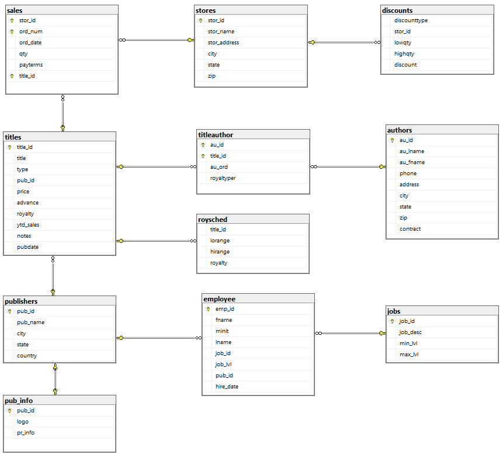

# Data Management in MS SQL Server

This project demostrates tools and processes for data modeling in Relational Database Management Systems (RDBMS) using Microsoft SQL Server. Topics include SQL data definition language (DDL), SQL data manipulation language (DML), views, security, transaction management, triggers and stored procedures.

## The Databases

This project focuses on two databases, BookStore database and Supplychain database, that are used to study SQL fundamental design concepts and industry standards.

### Bookstore Database

This database contains 11 tables, the Entity Relational Diagram (ERD) as following:

To explore the SQL techniques and the characteristics of relational models in database design and transaction management in MS SQL Server, this project covers four main sections:

[PART-I](./BookStore/PART-I): Basic SQL Statements and Functions

[PART-II](./BookStore/PART-II): Table Manipulations

[PART-III](./BookStore/PART-III): Case, Views, Subqueries, Indexes

[PART-IV](./BookStore/PART-IV): Variables, Sequence Control, Stored Procedures, Triggers

### Supplychain Database

    N/A
